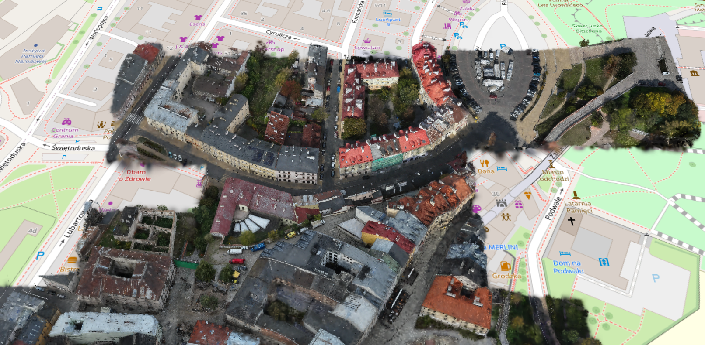

# cesium-splat-streetview

Stream city-scale 3D Gaussian Splat reconstructions inside [CesiumJS](https://cesium.com/platform/cesiumjs/) at their real-world geographic location — no Three.js overlay, no custom renderer, just native Cesium 3D Tiles + the [`KHR_gaussian_splatting`](https://github.com/KhronosGroup/glTF/blob/main/extensions/2.0/Khronos/KHR_gaussian_splatting/README.md) glTF extension.

Demo dataset: drone + ground photogrammetry capture of **Lublin Old Town, Poland** by Andrii Shramko / Teleportour (2025).

Built on top of [`tebben/cesium-gaussian-splatting`](https://github.com/tebben/cesium-gaussian-splatting) (Cesium scaffold + Vite/GitHub-Pages build).



## What this is

The viewer loads a set of 3D Tiles tilesets whose tile content is SPZ-compressed Gaussian splats. Cesium handles LOD streaming, frustum culling, GPU memory, and the splat decoder — the same way it handles a 3D Tiles photogrammetry mesh or a B3DM tileset. Tiles refine as you zoom in; coarse roots cover whole districts, deep leaves cover individual blocks.

The Lublin dataset is split into 10 spatial cells with density-aware sizing (small cells in the dense Old Town core, big cells in the sparse outskirts). Cesium frustum-culls cells outside the view so only the visible ones consume memory, and splitting also sidesteps a CesiumJS 1.141 splat-orientation bug that triggers on single dense tilesets — both reasons documented under reproduction below.

## Run the demo locally

```sh
npm install
npm run dev
```

Open <http://localhost:3001/cesium-splat-streetview/>. Click **▶ Play Demo** for the scripted intro, or **→ Fly to Lublin City 2025 (Poland)** to drop in directly.

Keyboard once you're over the city:
- `R` / `T` — fly forward / back (horizontal, along camera heading)
- `D` / `F` — strafe left / right
- `PgUp` / `PgDn` — altitude up / down
- Arrows — look around (rotate heading + pitch)
- `Shift + any` — 5× speed multiplier

Plain `npm run dev` renders the Cesium globe and our demo UI, **but no splats** unless you have the Lublin tileset under `public/data/lublin-3dtiles/`. Reproducing the tileset is below.

## Reproduce the Lublin tileset

The demo expects `public/data/lublin-3dtiles/tileset.json` (3D Tiles 1.1 with SPZ-compressed GLB tiles). Producing it from the source PLY:

### 1. Get the source PLY

The Lublin City scan 2025 dataset is published by Andrii Shramko / Teleportour. Contact them for access: [andrii@teleportour.com](mailto:andrii@teleportour.com) or via [LinkedIn](https://www.linkedin.com/in/andrii-shramko/). Mandatory attribution applies to any use — see the dataset's `License Agreement - Options 1 and 2.md`.

Drop the PLY anywhere on disk. The path doesn't matter; pass it to the converter below.

### 2. Install the 3DGS → 3D Tiles converter

```sh
npm install -g 3dgs-ply-3dtiles-converter
```

Requires Node.js 18+. Uses [WilliamLiu-1997/3DGS-PLY-3DTiles-Converter](https://github.com/WilliamLiu-1997/3DGS-PLY-3DTiles-Converter) under the hood: builds an adaptive k-d tree, emits SPZ-compressed GLBs per leaf, generates hierarchical LOD ancestors.

### 3. Split the PLY into spatial cells

The Lublin scan has ~259 M splats with 62 % packed into the south-west quadrant (Old Town core). Feeding the whole PLY to the converter produces one giant tileset whose top-LOD per-tileset texture aggregation runs out of JS heap once you zoom in, and the dense leaves overflow SPZ's per-tile position-scale range (which trips a separate Cesium 1.141 splat-orientation bug — see `tools/bug_report_cesium_splat_node_matrix.md`).

The fix is a density-aware spatial split: small cells in the dense core, big cells in the sparse outskirts. `tools/ply_split_spatial.py` does this in one streaming pass, also applying the `sigmoid(opacity)` and `up-axis: +z` corrections needed for the converter's `khr_native` convention.

```sh
python tools/ply_split_spatial.py \
  "/path/to/Lublin-Poland-001.ply" \
  --out-dir "/path/to/spatial-cells" \
  --cells "\
nw:-1100,0,-100,0,1100,200;\
ne:0,0,-100,1100,1100,200;\
se:0,-700,-100,1100,0,200;\
sw_nw:-650,-330,-100,-200,0,200;\
sw_sw:-650,-700,-100,-200,-330,200;\
sw_se:-200,-700,-100,200,-330,200;\
sw_ne_nw:-200,-110,-100,0,0,200;\
sw_ne_ne:0,-110,-100,200,0,200;\
sw_ne_sw:-200,-330,-100,0,-110,200;\
sw_ne_se:0,-330,-100,200,-110,200"
```

Outputs 10 cell PLYs, ~5 M – 50 M splats each (max under the converter's safe per-cell ceiling). Streaming, NumPy-only, ~80 s on NVMe. Requires Python 3.10+ and NumPy.

### 4. Convert each cell to 3D Tiles

```sh
for CELL in nw ne se sw_nw sw_sw sw_se sw_ne_nw sw_ne_ne sw_ne_sw sw_ne_se; do
  3dgs-ply-3dtiles-converter \
    "/path/to/spatial-cells/${CELL}.ply" \
    "public/data/lublin-cell-${CELL}" \
    --coordinate "[51.248238,22.567850,-20.26]" \
    --input-convention khr_native \
    --coverage-boost-scale 0 \
    --max-depth 8 \
    --memory-budget 12 \
    --no-open-inspector \
    --clean
done
```

- `--coordinate "[lat, lon, height_m]"` — geographic anchor of the PLY's origin (UTM-34N → WGS84 lat/lon for Lublin). The height is an empirical visual offset (no terrain in this demo; OSM imagery sits at h=0).
- `--input-convention khr_native` — the split step already applied sigmoid, so the converter reads opacity as linear `[0, 1]`. Required because graphdeco scrambles the per-splat quaternions on this PLY.
- **`--coverage-boost-scale 0 --max-depth 8`** — workaround for a CesiumJS 1.141 bug. With defaults, the converter writes GLB node matrices with `positionScale<1` to keep boosted Gaussian scales inside SPZ's representable range. Cesium 1.141's `KHR_gaussian_splatting` renderer doesn't propagate that matrix's rotation+scale into per-splat covariance — visible as a "blob with rays". Disabling coverage-boost and capping depth at 8 keeps every node matrix's column scale = 1.0. Removable once CesiumJS lands [PR #13245](https://github.com/CesiumGS/cesium/pull/13245) or equivalent.

Runtime: **~12 min** for all 10 cells (largest cell ~127 s). Total output ~8 GB on disk (down from 17.6 GB PLY via SPZ).

### 5. (optional) Generate KML waypoints

`tools/kml_waypoints/generate_waypoints.py` samples the OSM street network inside the dataset's footprint and emits one blue dot per sample. Not currently wired into the viewer (native Cesium controls handle navigation), but kept for future hover-to-enter UX.

```sh
python tools/kml_waypoints/generate_waypoints.py \
  --manifest public/data/lublin-cell-nw/tileset.json \
  --num-points 40 --prefix lublin
```

Requires Python 3.10+ and `pyproj`.

### 6. Run the demo

```sh
npm run dev
```

If the visual orientation is off after conversion, edit `src/datasets/lublin.ts`:
- `splat.orientationFixDeg` — per-axis rotation applied to `root.transform` after load
- `splat.additionalHeightM` — extra altitude along the local ENU normal
- `splat.maximumScreenSpaceError` — LOD aggressiveness (Cesium default 16; lower = more refinement)

The live `__nudgeHeight(deltaM)` and `__tileset.maximumScreenSpaceError = N` devtools helpers in `main.ts` let you iterate without code edits.

## Adding new datasets

Drop a new file in `src/datasets/<id>.ts` exporting a `DatasetConfig`, then register it in `src/datasets/index.ts`. The schema is in `src/datasets/types.ts`. Switch datasets at runtime with `?dataset=<id>` in the URL.

## Dataset attribution

The **Lublin City scan 2025** dataset is distributed separately by Andrii Shramko / Teleportour. Mandatory attribution string for any use:

> 3D scanning data created and provided by Andrii Shramko, Teleportour.  
> <https://www.linkedin.com/in/andrii-shramko/> · <https://www.linkedin.com/company/teleportour/> · [teleportour.com](https://teleportour.com)

Prohibited uses per the dataset license:
- Facial recognition / biometric identification
- License-plate identification
- Re-identification of individuals or vehicles

## Acknowledgements

- [WilliamLiu-1997/3DGS-PLY-3DTiles-Converter](https://github.com/WilliamLiu-1997/3DGS-PLY-3DTiles-Converter) — PLY → 3D Tiles converter.
- [Khronos](https://www.khronos.org/) for `KHR_gaussian_splatting` + `KHR_gaussian_splatting_compression_spz_2`.
- [Niantic Spatial](https://www.nianticspatial.com/) for SPZ.
- [CesiumGS](https://cesium.com/) for the native 3DGS rendering in CesiumJS 1.135+.
- Andrii Shramko / Teleportour for releasing the Lublin City scan 2025 dataset.
